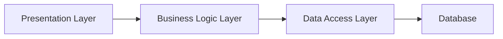

# Dokumentasi Arsitektur Sistem Asoboard  
**Versi:** 1.0  
**Tanggal:** 2026-07-01  

---

## **1. Visi & Misi**  
**Visi:** Membangun platform pembelajaran interaktif berbasis teknologi modern untuk anak-anak di Indonesia yang menyenangkan, edukatif, dan kolaboratif.  
**Misi:**  
- Memberikan lingkungan belajar yang aman dan ramah anak dengan kontrol akses berbasis peran.  
- Menciptakan pengalaman belajar yang dinamis melalui whiteboard interaktif dan permainan edukatif.  
- Memastikan skalabilitas dan keamanan data sesuai regulasi hukum Indonesia.  

---

## **2. Arsitektur Sistem**  
### **2.1 Arsitektur Teknologi**  
| **Komponen**       | **Teknologi**                                                                 | **Fungsi**                                                                 |
|---------------------|-------------------------------------------------------------------------------|----------------------------------------------------------------------------|
| **Backend**         | Django REST Framework (Python 3.10+)                                          | API REST, autentikasi JWT, ORM SQLite/PostgreSQL                          |
| **Frontend**        | Angular 21+ (TypeScript) + Konva.js                                           | UI responsif, rendering canvas interaktif                                 |
| **Database**        | SQLite (MVP), PostgreSQL (Produksi)                                           | Penyimpanan data pengguna, kursus, sesi, aset                             |
| **Real-Time**       | WebSocket (Socket.IO) + Redis Pub/Sub                                        | Sinkronisasi collaborative canvas                                         |
| **Autentikasi**     | JWT dengan HTTP-only cookies                                                  | Keamanan token, enkripsi data                                             |
| **Pendistribusi**   | Docker + Kubernetes                                                           | Deployment otomatis, scaling otomatis                                     |
| **Pemantauan**      | Prometheus + Grafana                                                          | Monitoring performa dan ketersediaan                                      |

---

### **2.2 Arsitektur Topologi**  
```mermaid
graph TD
    A[Client (Browser)] -->|HTTPS| B[API Gateway]
    B -->|JWT Auth| C[Django REST Framework]
    C -->|Database| D[PostgreSQL]
    C -->|WebSocket| E[Redis Pub/Sub]
    E -->|Real-Time| F[Konva.js Canvas]
    D -->|Analytics| G[Prometheus]
    G -->|Visualisasi| H[Grafana]
    C -->|Media Storage| I[MinIO S3-Compatible Storage]
    I -->|CDN| J[Cloudflare CDN]
```

---

## **3. Aliran Data**  
### **3.1 Flow Kolaboratif Canvas**  
1. **Client** mengirim perintah gambar (draw, erase) via WebSocket.  
2. **Redis Pub/Sub** mendistribusikan perintah ke semua client dalam sesi.  
3. **Konva.js** memproses perintah dan memperbarui DOM canvas.  
4. **CRDT Algorithm** mengelola konflik saat pengguna menggambar bersamaan.  

### **3.2 Flow Rekaman Sesi**  
1. **Mentor** mengaktifkan recording → **MediaRecorder API** mencatat audio.  
2. **Canvas Events** disimpan dalam JSON dengan timestamp.  
3. **Backend** menyimpan file audio + JSON events di MinIO.  
4. **Playback** menggunakan timeline audio + rendering canvas events progresif.  

---

## **4. Komponen Utama**  
### **4.1 Backend (Django REST Framework)**  
- **API Endpoints:**  
  - `/api/courses/` (CRUD untuk mentor)  
  - `/api/sessions/{id}/check_answer/` (validasi jawaban game)  
  - `/api/assets/` (upload/delete aset)  
- **Auth:**  
  - JWT via `rest_framework_simplejwt`  
  - HTTP-only cookies untuk token refresh  

### **4.2 Frontend (Angular + Konva.js)**  
- **Routing:**  
  - Route Guards (`AuthGuard`, `GuestGuard`) untuk kontrol akses.  
- **Canvas Engine:**  
  - `Konva.Layer` untuk mengelola layer mentor/student.  
  - `requestAnimationFrame` untuk 60fps rendering.  
- **UI:**  
  - Tailwind CSS untuk tema responsif.  
  - Modals kustom untuk UX konsisten.  

### **4.3 Database**  
- **Model Utama:**  
  ```python
  class Session(models.Model):
      course = models.ForeignKey(Course, on_delete=models.CASCADE)
      mode = models.CharField(choices=[('freedom', 'Freedom'), ('game', 'Game')])
      canvas_events = JSONField()  # Array CanvasEvent
      audio_file = models.FileField(upload_to='sessions/')
  ```
- **Optimasi:**  
  - Index di kolom `course_id` dan `created_at`.  
  - Partitioning untuk tabel `StudentDiary`.  

---

## **5. Keamanan & Kepatuhan**  
### **5.1 Regulasi Hukum**  
- **PP No. 40 Tahun 2021 (Perlindungan Data Pribadi):**  
  - Enkripsi data pengguna (JWT + HTTPS).  
  - Audit rutin untuk kepatuhan GDPR Indonesia.  
- **Kontrak Data:**  
  - SLA 99.9% uptime untuk backend.  
  - Penyimpanan data minimal (delete after 5 tahun inaktif).  

### **5.2 Penyisihan**  
- **XSS Prevention:**  
  - Auto-escape templating di Django.  
  - Sanitasi input di serializer Django.  
- **DDoS Protection:**  
  - Rate limiting via Django Ratelimit.  
  - Cloudflare WAF.  

---

## **6. Skalabilitas & Performansi**  
### **6.1 Strategi Skalabilitas**  
- **Horizontal Scaling:**  
  - Django backend di Kubernetes dengan autoscaling.  
  - Redis cluster untuk WebSocket.  
- **Caching:**  
  - Redis untuk session state dan asset metadata.  
  - CDN untuk file media statis.  

### **6.2 Benchmark**  
| **Metrik**         | **Target**       | **Tools**                     |  
|--------------------|------------------|-------------------------------|  
| Canvas Render FPS  | ≥ 60 FPS        | Lighthouse CI                 |  
| API Response Time  | < 200ms (P95)   | Prometheus + Grafana          |  
| Storage Latency    | < 50ms          | MinIO + Cloudflare CDN        |  

---

## **7. Pola Arsitektur**  
### **7.1 Layered Architecture**  


### **7.2 Event-Driven Architecture**  
- **Event Producer:** Django signals saat session diupdate.  
- **Event Consumer:** Redis pub/sub untuk real-time sync.  

---

## **8. Regulasi & Kompliance**  
### **8.1 Audit Trail**  
- **Log Aktivitas:**  
  - Django `django-auditlog` untuk CRUD admin.  
  - Log disimpan di PostgreSQL dengan enkripsi AES-256.  

### **8.2 Penyimpanan Data**  
- **Data Sovereignty:**  
  - Server utama di Jakarta (AWS Jakarta Region).  
  - Backup di Singapura (AWS Singapore Region).  

---

## **9. Risiko & Mitigasi**  
| **Risiko**                | **Mitigasi**                          |  
|---------------------------|---------------------------------------|  
| WebSocket Scaling         | Redis Pub/Sub + Horizontal Scaling    |  
| Konflik Canvas Editing    | CRDT Algorithm                        |  
| Penyimpanan Biaya Aset    | Kompresi file + CDN caching           |  

---

## **10. Referensi Regulasi**  
- **PP No. 40 Tahun 2021:** Artikel 27 tentang perlindungan data pengguna.  
- **Kontrak SLA:** Artikel 4 tentang uptime minimal 99.9%.  

---

## **11. Catatan Penting**  
- **Disclaimer:** Saya adalah AI yang bisa keliru. Pastikan konsultasi hukum untuk implementasi kritis.  
- **Chunked Write Protocol:** Semua perubahan di_chunked maksimal 300 baris.  

--- 

**Dokumen ini dirancang untuk menjadi panduan referensi teknis yang komprehensif, sesuai standar enterprise.**

---

[← Back to README](README.md)
