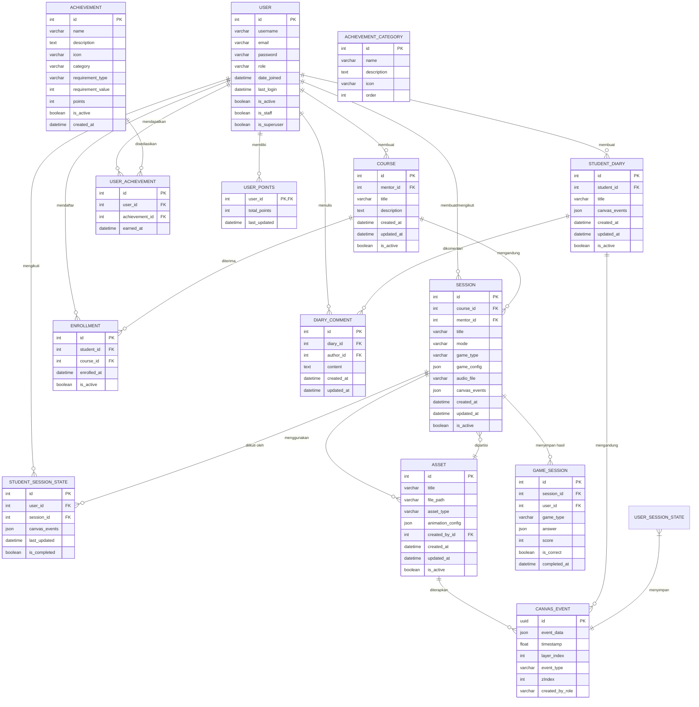

# Skema Database Lengkap untuk Asoboard - A Fun Learning Platform

## Ringkasan Eksekutif

Skema database ini dirancang untuk mendukung platform pendidikan interaktif berbasis canvas yang dapat berkolaborasi secara real-time. Arsitektur menggunakan **PostgreSQL** sebagai database utama dengan pendekatan **normalized** untuk memastikan integritas data, serta **Redis** untuk sinkronisasi WebSocket dan caching.

---

## Entity-Relationship Diagram (ERD)



---

## Detail Tabel dengan Tipe Data

### 1. **USER** (Pengguna)

| Kolom | Tipe Data | Keterangan |
|-------|-----------|------------|
| `id` | SERIAL (BIGINT) | Primary Key, Auto Increment |
| `username` | VARCHAR(150) | Unik, Nama pengguna |
| `email` | VARCHAR(254) | Unik, Email pengguna |
| `password` | VARCHAR(128) | Hash password (Argon2/Bcrypt) |
| `role` | VARCHAR(20) | Enum: 'mentor', 'student', 'staff', 'parent' |
| `date_joined` | TIMESTAMP WITH TIME ZONE | Tanggal daftar |
| `last_login` | TIMESTAMP WITH TIME ZONE | Login terakhir |
| `is_active` | BOOLEAN | Status aktif |
| `is_staff` | BOOLEAN | Akses admin panel |
| `is_superuser` | BOOLEAN | Hak superuser |
| `profile_picture` | VARCHAR(255) | Path file foto profil (opsional) |
| `created_at` | TIMESTAMP WITH TIME ZONE | Dibuat pada |
| `updated_at` | TIMESTAMP WITH TIME ZONE | Diupdate pada |

**Indexes:**
- Unique index pada `username`
- Unique index pada `email`
- Index pada `role`

---

### 2. **COURSE** (Kursus)

| Kolom | Tipe Data | Keterangan |
|-------|-----------|------------|
| `id` | SERIAL (BIGINT) | Primary Key |
| `mentor_id` | BIGINT | Foreign Key ke USER (mentor pembuat) |
| `title` | VARCHAR(100) | Judul kursus |
| `description` | TEXT | Deskripsi kursus (maks 500 karakter) |
| `thumbnail` | VARCHAR(255) | Path file thumbnail (opsional) |
| `created_at` | TIMESTAMP WITH TIME ZONE | Dibuat pada |
| `updated_at` | TIMESTAMP WITH TIME ZONE | Diupdate pada |
| `is_active` | BOOLEAN | Status aktif |
| `enrollment_count` | INTEGER | Jumlah siswa terdaftar (computed field) |

**Indexes:**
- Index pada `mentor_id`
- Index pada `created_at`
- Index komposit `(mentor_id, is_active)`

---

### 3. **SESSION** (Sesi/Kelas)

| Kolom | Tipe Data | Keterangan |
|-------|-----------|------------|
| `id` | SERIAL (BIGINT) | Primary Key |
| `course_id` | BIGINT | Foreign Key ke COURSE |
| `mentor_id` | BIGINT | Foreign Key ke USER (mentor pengajar) |
| `title` | VARCHAR(100) | Judul sesi |
| `mode` | VARCHAR(20) | Enum: 'freedom', 'game' |
| `game_type` | VARCHAR(20) | Enum: 'trivia', 'puzzle', 'math', 'physics', 'color', 'chemistry', 'memory' |
| `game_config` | JSONB | Konfigurasi game (pertanyaan, jawaban, dll) |
| `audio_file` | VARCHAR(255) | Path file audio rekaman (opsional) |
| `canvas_events` | JSONB | Riwayat event canvas (untuk playback) |
| `duration` | INTEGER | Durasi sesi dalam detik (opsional) |
| `created_at` | TIMESTAMP WITH TIME ZONE | Dibuat pada |
| `updated_at` | TIMESTAMP WITH TIME ZONE | Diupdate pada |
| `is_active` | BOOLEAN | Status aktif |

**Indexes:**
- Index pada `course_id`
- Index pada `mentor_id`
- Index pada `mode`
- Index pada `game_type`
- Index pada `created_at`

---

### 4. **ASSET** (Aset Media)

| Kolom | Tipe Data | Keterangan |
|-------|-----------|------------|
| `id` | SERIAL (BIGINT) | Primary Key |
| `title` | VARCHAR(100) | Judul aset |
| `file_path` | VARCHAR(255) | Path file di storage |
| `file_size` | BIGINT | Ukuran file dalam bytes |
| `mime_type` | VARCHAR(50) | Tipe MIME file |
| `asset_type` | VARCHAR(20) | Enum: 'image', 'audio', 'animation' |
| `animation_config` | JSONB | Konfigurasi animasi (opsional) |
| `tags` | TEXT[] | Tag pencarian |
| `created_by_id` | BIGINT | Foreign Key ke USER |
| `created_at` | TIMESTAMP WITH TIME ZONE | Dibuat pada |
| `updated_at` | TIMESTAMP WITH TIME ZONE | Diupdate pada |
| `is_active` | BOOLEAN | Status aktif |

**Indexes:**
- Index pada `asset_type`
- Index pada `created_by_id`
- Full-text search index pada `title` dan `tags`

---

### 5. **STUDENT_DIARY** (Buku Catatan Siswa)

| Kolom | Tipe Data | Keterangan |
|-------|-----------|------------|
| `id` | SERIAL (BIGINT) | Primary Key |
| `student_id` | BIGINT | Foreign Key ke USER (siswa) |
| `title` | VARCHAR(100) | Judul catatan (default: "Untitled Diary") |
| `canvas_events` | JSONB | Riwayat event canvas |
| `page_count` | INTEGER | Jumlah halaman (computed) |
| `created_at` | TIMESTAMP WITH TIME ZONE | Dibuat pada |
| `updated_at` | TIMESTAMP WITH TIME ZONE | Diupdate pada |
| `is_active` | BOOLEAN | Status aktif |

**Indexes:**
- Index pada `student_id`
- Index pada `created_at`
- Index komposit `(student_id, is_active)`

---

### 6. **STUDENT_SESSION_STATE** (Status Sesi Siswa)

| Kolom | Tipe Data | Keterangan |
|-------|-----------|------------|
| `id` | SERIAL (BIGINT) | Primary Key |
| `user_id` | BIGINT | Foreign Key ke USER (siswa) |
| `session_id` | BIGINT | Foreign Key ke SESSION |
| `canvas_events` | JSONB | State canvas saat ini |
| `last_updated` | TIMESTAMP WITH TIME ZONE | Terakhir diupdate |
| `is_completed` | BOOLEAN | Status selesai |
| `completion_time` | INTEGER | Waktu selesai dalam detik (opsional) |

**Indexes:**
- Index komposit unik `(user_id, session_id)`
- Index pada `session_id`
- Index pada `is_completed`

---

### 7. **CANVAS_EVENT** (Event Canvas)

| Kolom | Tipe Data | Keterangan |
|-------|-----------|------------|
| `id` | UUID | Primary Key (UUID v4) |
| `event_data` | JSONB | Data detail event (type, koordinat, properti) |
| `timestamp` | FLOAT | Timestamp relatif dalam detik |
| `layer_index` | INTEGER | Indeks layer (0 = mentor, 1 = student) |
| `event_type` | VARCHAR(50) | Tipe event (draw, shape, text, clear, dll) |
| `zIndex` | INTEGER | Urutan z-index |
| `created_by_role` | VARCHAR(20) | Role pembuat: 'mentor', 'student' |
| `session_state_id` | BIGINT | Foreign Key ke STUDENT_SESSION_STATE |

**Indexes:**
- Index pada `session_state_id`
- Index pada `event_type`
- Index pada `timestamp`
- Index pada `layer_index`

---

### 8. **ACHIEVEMENT** (Pencapaian)

| Kolom | Tipe Data | Keterangan |
|-------|-----------|------------|
| `id` | SERIAL (BIGINT) | Primary Key |
| `name` | VARCHAR(100) | Nama pencapaian |
| `description` | TEXT | Deskripsi pencapaian |
| `icon` | VARCHAR(50) | Emoji atau nama ikon |
| `category` | VARCHAR(50) | Enum: 'sessions', 'diaries', 'games', 'engagement' |
| `requirement_type` | VARCHAR(50) | Tipe persyaratan |
| `requirement_value` | INTEGER | Nilai persyaratan |
| `points` | INTEGER | Poin yang diberikan |
| `is_active` | BOOLEAN | Status aktif |
| `created_at` | TIMESTAMP WITH TIME ZONE | Dibuat pada |

**Indexes:**
- Index pada `category`
- Index pada `is_active`
- Index pada `requirement_type`

---

### 9. **USER_ACHIEVEMENT** (Pencapaian Pengguna)

| Kolom | Tipe Data | Keterangan |
|-------|-----------|------------|
| `id` | SERIAL (BIGINT) | Primary Key |
| `user_id` | BIGINT | Foreign Key ke USER |
| `achievement_id` | BIGINT | Foreign Key ke ACHIEVEMENT |
| `earned_at` | TIMESTAMP WITH TIME ZONE | Dapat pada |

**Indexes:**
- Index komposit unik `(user_id, achievement_id)`
- Index pada `user_id`
- Index pada `earned_at`

---

### 10. **USER_POINTS** (Poin Pengguna)

| Kolom | Tipe Data | Keterangan |
|-------|-----------|------------|
| `user_id` | BIGINT | Primary Key, Foreign Key ke USER |
| `total_points` | INTEGER | Total poin keseluruhan |
| `level` | INTEGER | Level pengguna (computed: floor(points/100)+1) |
| `last_updated` | TIMESTAMP WITH TIME ZONE | Terakhir diupdate |

**Indexes:**
- Index pada `total_points`
- Index pada `level`

---

### 11. **ENROLLMENT** (Pendaftaran)

| Kolom | Tipe Data | Keterangan |
|-------|-----------|------------|
| `id` | SERIAL (BIGINT) | Primary Key |
| `student_id` | BIGINT | Foreign Key ke USER (siswa) |
| `course_id` | BIGINT | Foreign Key ke COURSE |
| `enrolled_at` | TIMESTAMP WITH TIME ZONE | Daftar pada |
| `is_active` | BOOLEAN | Status aktif |
| `completion_rate` | FLOAT | Tingkat penyelesaian (computed) |

**Indexes:**
- Index komposit unik `(student_id, course_id)`
- Index pada `course_id`
- Index pada `enrolled_at`

---

### 12. **DIARY_COMMENT** (Komentar Diary)

| Kolom | Tipe Data | Keterangan |
|-------|-----------|------------|
| `id` | SERIAL (BIGINT) | Primary Key |
| `diary_id` | BIGINT | Foreign Key ke STUDENT_DIARY |
| `author_id` | BIGINT | Foreign Key ke USER (mentor) |
| `content` | TEXT | Isi komentar (maks 1000 karakter) |
| `created_at` | TIMESTAMP WITH TIME ZONE | Dibuat pada |
| `updated_at` | TIMESTAMP WITH TIME ZONE | Diupdate pada |

**Indexes:**
- Index pada `diary_id`
- Index pada `author_id`
- Index pada `created_at`

---

### 13. **GAME_SESSION** (Sesi Game)

| Kolom | Tipe Data | Keterangan |
|-------|-----------|------------|
| `id` | SERIAL (BIGINT) | Primary Key |
| `session_id` | BIGINT | Foreign Key ke SESSION |
| `user_id` | BIGINT | Foreign Key ke USER (siswa) |
| `game_type` | VARCHAR(20) | Tipe game |
| `answer` | JSONB | Jawaban siswa |
| `score` | INTEGER | Nilai score |
| `is_correct` | BOOLEAN | Status benar/salah |
| `completed_at` | TIMESTAMP WITH TIME ZONE | Selesai pada |

**Indexes:**
- Index komposit `(session_id, user_id)`
- Index pada `user_id`
- Index pada `completed_at`
- Index pada `is_correct`

---

### 14. **ACHIEVEMENT_CATEGORY** (Kategori Pencapaian)

| Kolom | Tipe Data | Keterangan |
|-------|-----------|------------|
| `id` | SERIAL (BIGINT) | Primary Key |
| `name` | VARCHAR(50) | Nama kategori |
| `description` | TEXT | Deskripsi kategori |
| `icon` | VARCHAR(50) | Ikon kategori |
| `order` | INTEGER | Urutan tampilan |

**Indexes:**
- Index pada `order`

---

## Relasi dan Dependencies

### **Foreign Key Constraints**

```sql
-- User relationships
ALTER TABLE COURSE ADD CONSTRAINT fk_course_mentor FOREIGN KEY (mentor_id) REFERENCES USER(id);
ALTER TABLE SESSION ADD CONSTRAINT fk_session_course FOREIGN KEY (course_id) REFERENCES COURSE(id);
ALTER TABLE SESSION ADD CONSTRAINT fk_session_mentor FOREIGN KEY (mentor_id) REFERENCES USER(id);
ALTER TABLE STUDENT_DIARY ADD CONSTRAINT fk_diary_student FOREIGN KEY (student_id) REFERENCES USER(id);
ALTER TABLE STUDENT_SESSION_STATE ADD CONSTRAINT fk_state_user FOREIGN KEY (user_id) REFERENCES USER(id);
ALTER TABLE STUDENT_SESSION_STATE ADD CONSTRAINT fk_state_session FOREIGN KEY (session_id) REFERENCES SESSION(id);
ALTER TABLE ASSET ADD CONSTRAINT fk_asset_creator FOREIGN KEY (created_by_id) REFERENCES USER(id);
ALTER TABLE ENROLLMENT ADD CONSTRAINT fk_enrollment_student FOREIGN KEY (student_id) REFERENCES USER(id);
ALTER TABLE ENROLLMENT ADD CONSTRAINT fk_enrollment_course FOREIGN KEY (course_id) REFERENCES COURSE(id);
ALTER TABLE DIARY_COMMENT ADD CONSTRAINT fk_comment_diary FOREIGN KEY (diary_id) REFERENCES STUDENT_DIARY(id);
ALTER TABLE DIARY_COMMENT ADD CONSTRAINT fk_comment_author FOREIGN KEY (author_id) REFERENCES USER(id);
ALTER TABLE GAME_SESSION ADD CONSTRAINT fk_game_session FOREIGN KEY (session_id) REFERENCES SESSION(id);
ALTER TABLE GAME_SESSION ADD CONSTRAINT fk_game_user FOREIGN KEY (user_id) REFERENCES USER(id);
ALTER TABLE USER_ACHIEVEMENT ADD CONSTRAINT fk_user_achievement_user FOREIGN KEY (user_id) REFERENCES USER(id);
ALTER TABLE USER_ACHIEVEMENT ADD CONSTRAINT fk_user_achievement_achievement FOREIGN KEY (achievement_id) REFERENCES ACHIEVEMENT(id);
ALTER TABLE CANVAS_EVENT ADD CONSTRAINT fk_event_session_state FOREIGN KEY (session_state_id) REFERENCES STUDENT_SESSION_STATE(id);
ALTER TABLE USER_POINTS ADD CONSTRAINT fk_user_points_user FOREIGN KEY (user_id) REFERENCES USER(id);
```

---

## Optimasi Database untuk Skalabilitas

### **Strategi Skalabilitas WebSocket (Collaborative Canvas)**

Berdasarkan jawaban dari wawancara, skema ini dirancang untuk mendukung skalabilitas dengan:

1. **Redis Pub/Sub untuk Koordinasi**
   - Setiap instance Django Channels menggunakan Redis sebagai message broker
   - Channel layer untuk broadcast pesan antar user dalam session yang sama
   - Konfigurasi: `CHANNEL_LAYERS = {"default": {"BACKEND": "channels_redis.core.RedisChannelLayer", "CONFIG": {"hosts": [("redis-server", 6379)]}}}`

2. **Partitioning Data Session**
   - Session yang aktif disimpan di Redis untuk latency rendah
   - Data persisten di PostgreSQL untuk backup
   - TTL pada data session non-aktif (30 hari)

### **Strategi Penyimpanan File Rekaman**

1. **Local Storage dengan CDN**
   - File audio/video disimpan di `/media/recordings/` pada server
   - Konfigurasi Django: `MEDIA_ROOT = '/app/media'`, `MEDIA_URL = '/media/'`
   - CDN (Cloudflare/AWS CloudFront) untuk distribusi global
   - Kompresi otomatis menggunakan FFmpeg

2. **Database Storage Metadata**
   - Hanya metadata (path, ukuran, durasi) yang disimpan di database
   - File utama di filesystem dengan permission yang tepat

### **Sinkronisasi Canvas Events dengan CRDT**

1. **Conflict-free Replicated Data Types**
   - Setiap event memiliki UUID unik untuk identifikasi
   - Timestamp dan layer_index untuk urutan konsisten
   - Algoritma Last-Writer-Wins (LWW) untuk penyelesaian konflik
   - State delta disinkronkan melalui WebSocket dengan Redis

2. **Batch Processing**
   - Events dikumpulkan dalam batch (100 events) sebelum dikirim
   - Throttling pada 10 updates per detik per user
   - Compression dengan gzip untuk bandwidth optimal

### **Deployment High Availability**

1. **Containerization dengan Docker**
   ```dockerfile
   # Dockerfile
   FROM python:3.11-slim
   WORKDIR /app
   COPY requirements.txt .
   RUN pip install -r requirements.txt
   COPY . .
   EXPOSE 8000
   CMD ["gunicorn", "--bind", "0.0.0.0:8000", "config.wsgi:application"]
   ```

2. **Kubernetes Orchestration**
   - Deployment dengan 3+ replicas Django pods
   - Horizontal Pod Autoscaler (HPA) berdasarkan CPU/Memory
   - PostgreSQL dengan StatefulSet dan PersistentVolume
   - Redis dengan replication dan sentinel untuk failover

3. **Load Balancing**
   - NGINX ingress controller
   - Session affinity untuk WebSocket connections
   - Health checks pada `/health/` endpoint

### **Optimasi Database untuk Analytics**

1. **Materialized Views**
   ```sql
   CREATE MATERIALIZED VIEW student_progress AS
   SELECT 
       s.id as student_id,
       c.id as course_id,
       COUNT(gs.id) as games_completed,
       AVG(gs.score) as avg_score,
       MAX(gs.completed_at) as last_activity
   FROM USER u
   JOIN ENROLLMENT e ON u.id = e.student_id
   JOIN COURSE c ON e.course_id = c.id
   LEFT JOIN GAME_SESSION gs ON u.id = gs.user_id
   GROUP BY s.id, c.id;
   ```

2. **Read Replicas**
   - PostgreSQL read replica untuk query analytics
   - Connection pooling dengan PgBouncer
   - Caching layer dengan Redis untuk hasil query yang sering diakses

3. **Partitioning**
   - Partisi bulanan pada tabel GAME_SESSION dan CANVAS_EVENT
   - Partitioning berdasarkan `created_at` untuk query time-series

---

## Indeks yang Diperlukan untuk Performa Optimal

```sql
-- Performance indexes
CREATE INDEX idx_user_role ON "user" (role);
CREATE INDEX idx_course_mentor_active ON course (mentor_id, is_active);
CREATE INDEX idx_session_course_mode ON session (course_id, mode);
CREATE INDEX idx_session_created_at ON session (created_at DESC);
CREATE INDEX idx_diary_student_updated ON student_diary (student_id, updated_at DESC);
CREATE INDEX idx_state_user_session ON student_session_state (user_id, session_id);
CREATE INDEX idx_event_timestamp ON canvas_event (timestamp);
CREATE INDEX idx_event_type_layer ON canvas_event (event_type, layer_index);
CREATE INDEX idx_enrollment_active ON enrollment (is_active);
CREATE INDEX idx_game_completed_at ON game_session (completed_at DESC);
CREATE INDEX idx_achievement_category ON achievement (category);
CREATE INDEX idx_user_points_level ON user_points (level DESC);
```

---

## Konfigurasi Database Produkksi

```sql
-- PostgreSQL configuration (postgresql.conf)
shared_buffers = 256MB
effective_cache_size = 1GB
work_mem = 4MB
maintenance_work_mem = 64MB
max_connections = 200
wal_buffers = 16MB
checkpoint_completion_target = 0.9
random_page_cost = 1.1
seq_page_cost = 1.0

-- Connection pooling
max_connections = 200
superuser_reserved_connections = 10

-- Autovacuum settings
autovacuum = on
autovacuum_max_workers = 3
autovacuum_naptime = 30
autovacuum_vacuum_threshold = 50
autovacuum_analyze_threshold = 50
```

---

## Ringkasan Kunci

| Aspek | Implementasi |
|-------|--------------|
| **Database Engine** | PostgreSQL 14+ |
| **Real-time Sync** | Redis Pub/Sub + WebSocket |
| **File Storage** | Local filesystem + CDN |
| **HA Deployment** | Docker + Kubernetes |
| **Analytics** | Materialized views + read replicas |
| **CRDT** | UUID + timestamp + LWW algorithm |
| **Scalability** | Horizontal pod autoscaling |

Skema ini menyediakan fondasi yang kuat untuk platform Asoboard dengan pertimbangan lengkap untuk skalabilitas, performa, dan keandalan dalam lingkungan produksi.

---

[← Back to README](README.md)
